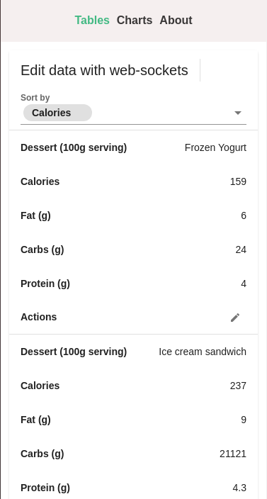
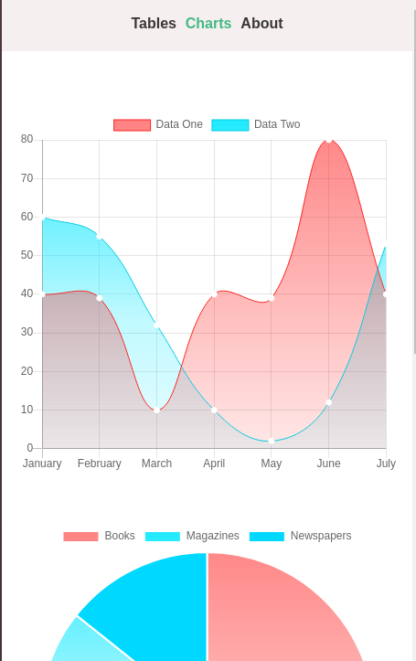
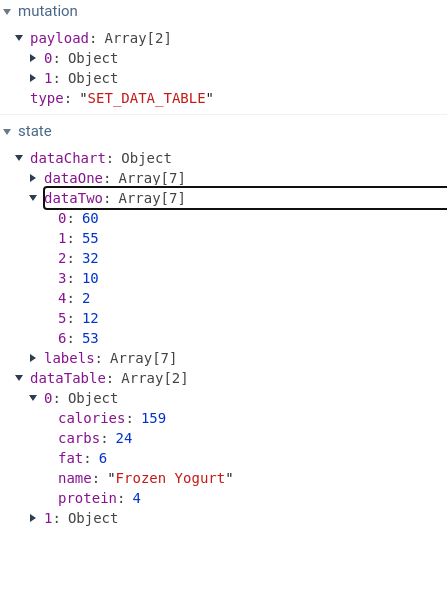

# Vue-Node.js-Websockets (vue-socket)- vue-chart app

Little project with technologies which you can read above which show, how simple is to work with websockets and charts using vue.js and node
Небольшой проект, на технологиях описанных в названии, который показывает, как просто на vue и node.js работать с websockets и графиками

## Prerequisites || Необходимые условия
Убедитесь, что у вас установлен node.js 
Make sure that yoy globally install node.js
https://nodejs.org/en/

Make sure that needed ports are free || Убедитесь, что свободны требуемые порты

client basically is workin on 8080 port, server - 3300
клиент базисно работает на 8080 порту, сервер 3300 порт

### Installing || Установка
* With make file || С помощью make файла:
Запускаем из корня приложения:
Run commands from root directory of the project

make build - install all deps || установить сразу все зависимости
make run/server
make run/client

* Natively || Нативно:
cd /server

npm install

npm run server

cd /client 
npm install

npm run serve

```
Examples || примеры



```
